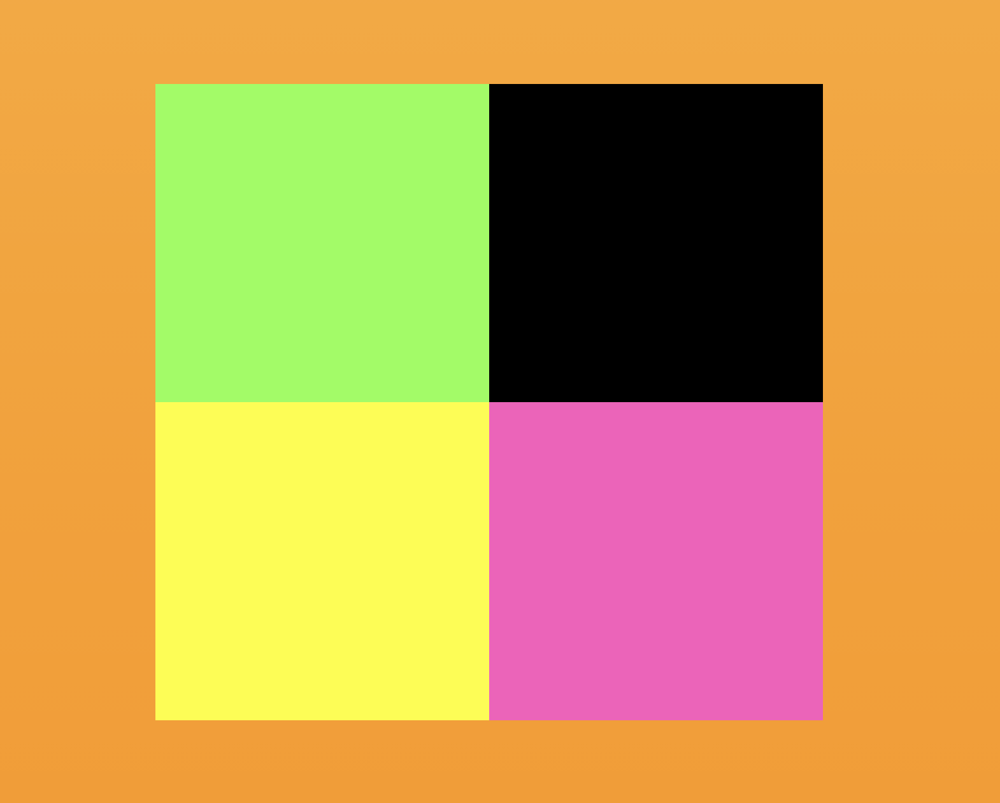

### Introduction
minipad is my first attempt using the React/Redux framework. Whene I started my journey into webdev, I was making boxes and immediately thoguht, "I bet I can make these make sounds." I love putting sounds together, and drum pads are a fun way make a collage of different samples of audio. 

There are four pads right now, each with their drum loops and samples. 

### Installation
bootstrap
react
react-bootstrap
react-dom
react-redux
react-router-dom
react-scripts
redux
styled-components
web-vitals